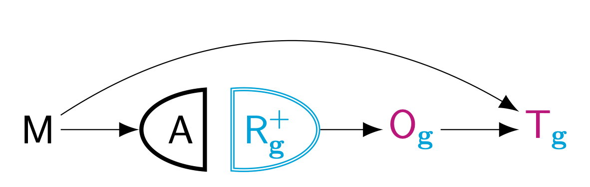

<!-- README.md is generated from README.Rmd. Please edit that file -->
<!-- ```{r, include = FALSE} -->
<!-- library(here) -->
<!-- # GitHub pages -->
<!-- file.create("docs/.nojekyll", showWarnings = FALSE) -->
<!-- ``` -->
<!-- badges: start -->



<!-- badges: end -->
<!-- badges: end -->

# margot

**MARG**inal **O**bservational **T**reatment-effects.[^1]

Causal inference requires **balance** across the treatments to be
compared. In observational studies, such balance is not guaranteed;
quantifying causality therefore requires careful, multi-step workflows.

The goal of `margot` is to enhance the accessibility of these workflows
for causal inference. Its primary audience includes psychological
scientists, although it may benefit other social scientists.

The package offers functions for:

- evaluating causal assumptions
- modelling time-series data
- reporting results
- performing sensitivity analyses

`margot` focuses on streamlining the estimation of (Marginal) Average
Treatment Effects, but it also supports workflows for Conditional
Average Treatment Effects and exploring Heterogeneous Treatment Effects,
as well as Modified Treatment Policies.

## Installation

You can install the development version of `margot` like so:

``` r
if (!require(devtools, quietly = TRUE)) {
  install.packages("devtools")
  library(devtools)
}

devtools::install_github("go-bayes/margot")
```

## Code

Go to:<https://github.com/go-bayes/margot>

### License

The code in this package is licensed under the Creative Commons
Attribution 4.0 International (CC BY 4.0) license. You are free to share
and adapt the code, even for commercial purposes, provided that you
attribute the original author(s) appropriately. For more information,
see [CC BY 4.0](https://creativecommons.org/licenses/by/4.0/legalcode).

The `margot` package is distributed in the hope that it will be useful,
but WITHOUT ANY WARRANTY; without even the implied warranty of
MERCHANTABILITY or FITNESS FOR A PARTICULAR PURPOSE. See the Disclaimer
of Warranties and Limitation of Liability section in the licensing
information for more details.

### Citing `margot`

If you use the `margot` package in your research, you may cite it as
follows:

``` r
bibentry(
  bibtype = "Manual",
  title = "margot: MARGinal Observational Treatment-effects",
  author = person("Joseph A", "Bulbulia"),
  year = "2024",
  note = "R package version 1.0.38, Functions to obtain MARGinal Observational Treatment-effects from observational data.",
  url = "https://go-bayes.github.io/margot/",
  doi = "10.5281/zenodo.10907724"
)
```

## Doi

[](https://zenodo.org/doi/10.5281/zenodo.10907723)

[^1]: The logo is a *Single World Intervention Template* (SWIT). We use
    a SWIT to generate *Single World Intervention Graphs* (SWIGs) –
    causal diagrams for which identification assumptions can be read
    separately for each treatment (regime) to be compared. The name
    `margot` reflects the contents and aims of this package; it is also
    the name of my daughter, Margot.
