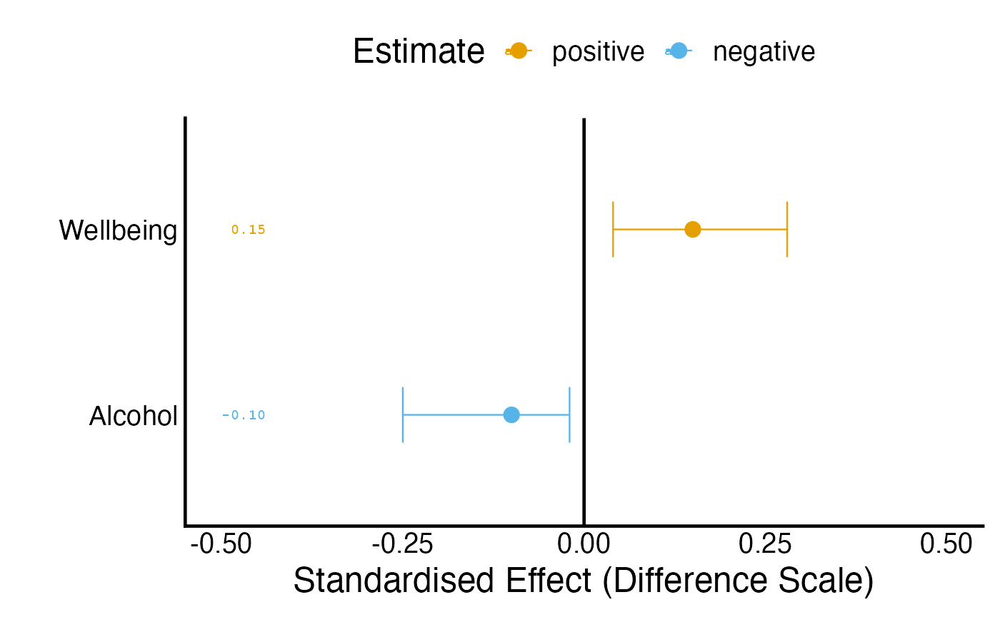

# Average-effect reporting and outcome scales

[`margot_plot_ate()`](https://go-bayes.github.io/margot/reference/margot_plot_ate.md),
[`margot_table_ate()`](https://go-bayes.github.io/margot/reference/margot_table_ate.md)
and
[`margot_interpret_ate()`](https://go-bayes.github.io/margot/reference/margot_interpret_ate.md)
produce a figure, a numerical table and prose from the same reporting
calculation.
[`margot_plot()`](https://go-bayes.github.io/margot/reference/margot_plot.md)
remains available and returns all three as `plot`, `transformed_table`
and `interpretation`. The example below uses invented estimates and
sensitivity quantities; it fits no model and uses no participant data.

\
`estimates`` ``<-`` `[`data.frame`](https://rdrr.io/r/base/data.frame.html)`(`\
`  outcome ``=`` `[`c`](https://rdrr.io/r/base/c.html)`(``"wellbeing_z"``, ``"alcohol_z"``)``,`\
`  ATE ``=`` `[`c`](https://rdrr.io/r/base/c.html)`(``0.15``, ``-``0.10``)``,`\
`  E_Value ``=`` `[`c`](https://rdrr.io/r/base/c.html)`(``1.8``, ``1.6``)``,`\
`  E_Val_bound ``=`` `[`c`](https://rdrr.io/r/base/c.html)`(``1.3``, ``1.2``)`\
`)`\
`estimates``[[``"2.5 %"``]``]`` ``<-`` `[`c`](https://rdrr.io/r/base/c.html)`(``0.04``, ``-``0.25``)`\
`estimates``[[``"97.5 %"``]``]`` ``<-`` `[`c`](https://rdrr.io/r/base/c.html)`(``0.28``, ``-``0.02``)`\
`scales`` ``<-`` `[`data.frame`](https://rdrr.io/r/base/data.frame.html)`(`\
`  outcome ``=`` `[`c`](https://rdrr.io/r/base/c.html)`(``"wellbeing_z"``, ``"alcohol_z"``)``,`\
`  transformation ``=`` ``"identity"``,`\
`  center ``=`` `[`c`](https://rdrr.io/r/base/c.html)`(``4``, ``3``)``, scale ``=`` `[`c`](https://rdrr.io/r/base/c.html)`(``1.2``, ``2``)``, orientation ``=`` ``1``,`\
`  unit ``=`` `[`c`](https://rdrr.io/r/base/c.html)`(``"points"``, ``"drinks"``)``, unit_multiplier ``=`` ``1`\
`)`\
[`margot_plot_ate`](https://go-bayes.github.io/margot/reference/margot_plot_ate.md)`(``estimates``, scale_info ``=`` ``scales``, e_val_bound_threshold ``=`` ``1``)`\
`#> ``ℹ`` no multiplicity adjustment applied`\
`#> ``ℹ`` Transformed label: wellbeing_z -> Wellbeing`\
`#> ``ℹ`` Transformed label: alcohol_z -> Alcohol`\
`#> Loading required package: dplyr`\
`#> `\
`#> Attaching package: 'dplyr'`\
`#> The following objects are masked from 'package:stats':`\
`#> `\
`#>     filter, lag`\
`#> The following objects are masked from 'package:base':`\
`#> `\
`#>     intersect, setdiff, setequal, union`



\
[`margot_table_ate`](https://go-bayes.github.io/margot/reference/margot_table_ate.md)`(``estimates``, scale_info ``=`` ``scales``, e_val_bound_threshold ``=`` ``1``)`\
`#> ``ℹ`` no multiplicity adjustment applied`\
`#> ``ℹ`` Transformed label: wellbeing_z -> Wellbeing`\
`#> ``ℹ`` Transformed label: alcohol_z -> Alcohol`\
`#>             ATE 2.5 % 97.5 % confidence_level E_Value E_Val_bound`\
`#> Wellbeing  0.15  0.04   0.28             0.95     1.8         1.3`\
`#> Alcohol   -0.10 -0.25  -0.02             0.95     1.6         1.2`\
`#>           reported_estimate reported_lower reported_upper reporting_quantity`\
`#> Wellbeing              0.18          0.048          0.336    mean_difference`\
`#> Alcohol               -0.20         -0.500         -0.040    mean_difference`\
`#>           reporting_unit`\
`#> Wellbeing         points`\
`#> Alcohol           drinks`\
[`cat`](https://rdrr.io/r/base/cat.html)`(`[`margot_interpret_ate`](https://go-bayes.github.io/margot/reference/margot_interpret_ate.md)`(``estimates``, scale_info ``=`` ``scales``, e_val_bound_threshold ``=`` ``1``)``)`\
`#> ``ℹ`` no multiplicity adjustment applied`\
`#> ``ℹ`` Transformed label: wellbeing_z -> Wellbeing`\
`#> ``ℹ`` Transformed label: alcohol_z -> Alcohol`\
`#> Confidence intervals were reported as 95% CI. No adjustment was made for family‑wise error rates to E‑values.`\
`#> `\
`#> The following estimates of average treatment effects meet the specified reporting threshold (E‑value lower bound >= 1):`\
`#> `\
`#> - Wellbeing: 0.150 (95% CI: 0.040 to 0.280); on the original scale, mean difference = 0.180 points (95% CI: 0.048 to 0.336). E-value bound = 1.30`\
`#> - Alcohol: -0.100 (95% CI: -0.250 to -0.020); on the original scale, mean difference = -0.200 drinks (95% CI: -0.500 to -0.040). E-value bound = 1.20`

The graph retains the supplied model-scale estimates and intervals. The
table retains those numbers and adds `reported_estimate`,
`reported_lower`, `reported_upper`, `reporting_quantity` and
`reporting_unit`. Its `confidence_level` column preserves each
interval’s supplied coverage. Prose reports the supported conversion
alongside the model-scale estimate. The E-value threshold controls which
estimates enter the prose; it does not establish identification or
remove the need to report other planned outcomes. E-values remain tied
to their supplied scientific scale and calculation, not to a change of
display units.

## Record preparation constants

Let `Y` denote the measured outcome and `g` its declared transformation.
Metadata describes the model outcome as
`orientation * (g(Y) - center) / scale`. Each row of `scale_info`
matches an original outcome key before display labels change. Store the
constants from preparation rather than recomputing them from a reporting
subset.

| Field | Meaning | Default |
|----|----|----|
| `outcome` | Original outcome key in the estimate table | Required |
| `transformation` | `identity`, `log`, or `log1p` | `identity` |
| `center` | Centre subtracted during preparation | 0 |
| `scale` | Positive divisor used during preparation | 1 |
| `orientation` | Outcome orientation, 1 or -1 | 1 |
| `unit` | Unit label for the reported affine difference | Empty |
| `unit_multiplier` | Positive affine unit conversion, such as 60 for hours to minutes | 1 |

For an affine mean difference, the centre cancels. The estimate and both
supplied confidence limits are multiplied by
`orientation * scale * unit_multiplier`; reversed limits are reordered.
This preserves asymmetric intervals and numerical precision. Display
functions may round printed numbers, but the numerical table retains
their precision. A ratio of centred outcomes cannot generally be
converted to an original-scale ratio from that contrast alone;
unsupported ratio conversions fail explicitly.

## The applied NZAVS convention uses unlogged values before standardisation

For the New Zealand Attitudes and Values Study (NZAVS), the current
applied preparation convention keeps continuous baseline and lagged
adjustment variables on their unlogged scientific scales before
z-standardisation. Exposure columns used to define an intervention
retain the registered exposure scale. Terminal outcomes also remain
unlogged: the exercise outcome is `hours_exercise`, measured in hours
per week. Scoring and orientation remain explicit measurement decisions;
omitting a logarithm does not remove those decisions.

For each terminal outcome, preparation records the unweighted mean and
sample standard deviation among that outcome’s primary estimation rows.
It applies those constants once and retains them across primary fits,
sensitivity analyses, groups, policy folds, and reports. This is the
same standardisation convention used by the developing GRF workflow. The
reference rows and their missing-data rule belong in the preparation
record. An unweighted standardisation reference does not replace the
analysis weights used to estimate a target-population contrast. Baseline
and lagged adjustment variables retain their own preparation constants,
separately from terminal-outcome constants.

The following example uses three invented primary-row exercise values
and an invented estimated contrast, interval, and E-values. It fits no
model. The saved mean is 2 hours per week, and the sample standard
deviation is 2 hours per week.

\
`primary_hours_exercise`` ``<-`` `[`c`](https://rdrr.io/r/base/c.html)`(``0``, ``2``, ``4``)`\
`exercise_center`` ``<-`` `[`mean`](https://rdrr.io/r/base/mean.html)`(``primary_hours_exercise``)`\
`exercise_scale`` ``<-`` `[`sd`](https://rdrr.io/r/stats/sd.html)`(``primary_hours_exercise``)`\
`exercise_z`` ``<-`` ``(``primary_hours_exercise`` ``-`` ``exercise_center``)`` ``/`` ``exercise_scale`\
\
`exercise_estimate`` ``<-`` `[`data.frame`](https://rdrr.io/r/base/data.frame.html)`(`\
`  outcome ``=`` ``"hours_exercise_z"``,`\
`  ATE ``=`` ``0.25``,`\
``   `2.5 %`  ```=`` ``0.10``,`\
``   `97.5 %`  ```=`` ``0.40``,`\
`  confidence_level ``=`` ``0.95``,`\
`  E_Value ``=`` ``1.8``,`\
`  E_Val_bound ``=`` ``1.4``,`\
`  check.names ``=`` ``FALSE`\
`)`\
`exercise_scale_info`` ``<-`` `[`data.frame`](https://rdrr.io/r/base/data.frame.html)`(`\
`  outcome ``=`` ``"hours_exercise_z"``,`\
`  transformation ``=`` ``"identity"``,`\
`  center ``=`` ``exercise_center``,`\
`  scale ``=`` ``exercise_scale``,`\
`  orientation ``=`` ``1``,`\
`  unit ``=`` ``"hours per week"``,`\
`  unit_multiplier ``=`` ``1`\
`)`\
`exercise_table`` ``<-`` `[`margot_table_ate`](https://go-bayes.github.io/margot/reference/margot_table_ate.md)`(`\
`  ``exercise_estimate``,`\
`  scale_info ``=`` ``exercise_scale_info``,`\
`  e_val_bound_threshold ``=`` ``1`\
`)`\
`#> ``ℹ`` no multiplicity adjustment applied`\
`#> ``ℹ`` Transformed label: hours_exercise_z -> Hours Exercise`\
`exercise_table``[``, `[`c`](https://rdrr.io/r/base/c.html)`(``"ATE"``, ``"reported_estimate"``, ``"reported_lower"``, ``"reported_upper"``)``]`\
`#>                 ATE reported_estimate reported_lower reported_upper`\
`#> Hours Exercise 0.25               0.5            0.2            0.8`\
[`cat`](https://rdrr.io/r/base/cat.html)`(`[`margot_interpret_ate`](https://go-bayes.github.io/margot/reference/margot_interpret_ate.md)`(`\
`  ``exercise_estimate``,`\
`  scale_info ``=`` ``exercise_scale_info``,`\
`  label_mapping ``=`` `[`list`](https://rdrr.io/r/base/list.html)`(``hours_exercise_z ``=`` ``"Weekly exercise"``)``,`\
`  e_val_bound_threshold ``=`` ``1`\
`)``)`\
`#> ``ℹ`` no multiplicity adjustment applied`\
`#> ``ℹ`` Mapped label (exact): hours_exercise_z -> Weekly exercise`\
`#> The following estimates of average treatment effects meet the specified reporting threshold (E‑value lower bound >= 1):`\
`#> `\
`#> - Weekly exercise: 0.250 (95% CI: 0.100 to 0.400); on the original scale, mean difference = 0.500 hours per week (95% CI: 0.200 to 0.800). E-value bound = 1.40`

The contrast of 0.25 standard deviations corresponds to 0.5 hours per
week, with the supplied 95% interval transformed to 0.2–0.8 hours per
week. The mean cancels from the difference. These are two scales for the
same affine mean contrast; the original-unit companion is not a new fit.

## Logarithms remain available for other outcome definitions

The applied NZAVS convention above does not remove Margot’s
general-purpose logarithmic reporting. Historical analyses retain their
specifications, and another scientific question may explicitly define a
logged outcome. The reported quantity must match that definition.

Exponentiating a difference of mean log outcomes gives a ratio of
geometric means. With `log1p`, it gives a ratio of geometric means of
`Y + 1`. Neither quantity is generally an arithmetic mean difference or
an arithmetic mean ratio. A transformed contrast cannot recover a
missing arithmetic-mean causal estimand merely by substituting a
reference mean.

\
`control`` ``<-`` `[`c`](https://rdrr.io/r/base/c.html)`(``0``, ``3``)`\
`policy`` ``<-`` `[`c`](https://rdrr.io/r/base/c.html)`(``1``, ``7``)`\
`log_difference`` ``<-`` `[`mean`](https://rdrr.io/r/base/mean.html)`(`[`log1p`](https://rdrr.io/r/base/Log.html)`(``policy``)``)`` ``-`` `[`mean`](https://rdrr.io/r/base/mean.html)`(`[`log1p`](https://rdrr.io/r/base/Log.html)`(``control``)``)`\
[`c`](https://rdrr.io/r/base/c.html)`(``shifted_geometric_mean_ratio ``=`` `[`exp`](https://rdrr.io/r/base/Log.html)`(``log_difference``)``,`\
`  arithmetic_mean_difference ``=`` `[`mean`](https://rdrr.io/r/base/mean.html)`(``policy``)`` ``-`` `[`mean`](https://rdrr.io/r/base/mean.html)`(``control``)``)`\
`#> shifted_geometric_mean_ratio   arithmetic_mean_difference `\
`#>                          2.0                          2.5`

The shifted geometric ratio is 2, whereas the arithmetic mean difference
is 2.5. These are different scientific quantities. Nonlinear reported
values therefore receive explicit geometric-ratio labels, and legacy
arithmetic `_original` columns remain missing. Do not pass the displayed
geometric ratio to a risk-ratio E-value formula.

## Existing calls

Calls to
[`margot_plot()`](https://go-bayes.github.io/margot/reference/margot_plot.md)
retain the combined list, argument precedence and saving behaviour. The
three focused interfaces select their respective component;
`save_output = TRUE` still saves the complete list. Existing
`original_df` calls infer transformations from outcome suffixes and
matching unstandardised source columns, with a warning that scale
constants may be recomputed. Legacy log names mean `log1p`; explicit
`scale_info` distinguishes ordinary logarithms. Missing or ambiguous
source columns require explicit metadata. No reporting path should
substitute an invented population mean.

When regenerating an existing study report, retain its
estimation-version record and separately record the reporting version
and corrected quantities. Reporting corrections do not imply that an
earlier study was estimated with a later package release.
