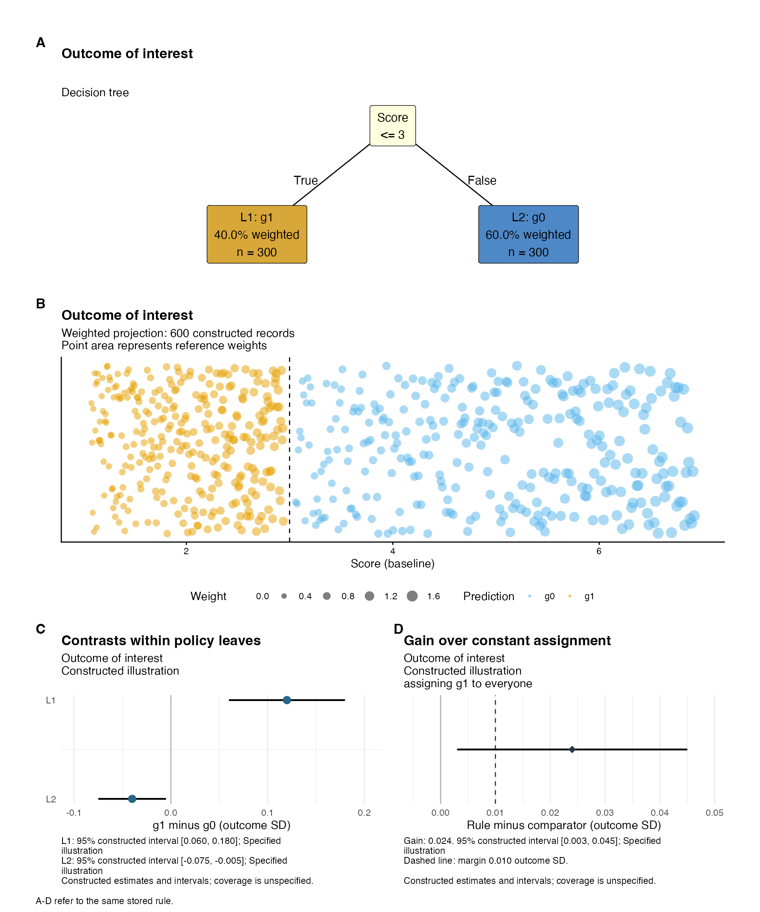
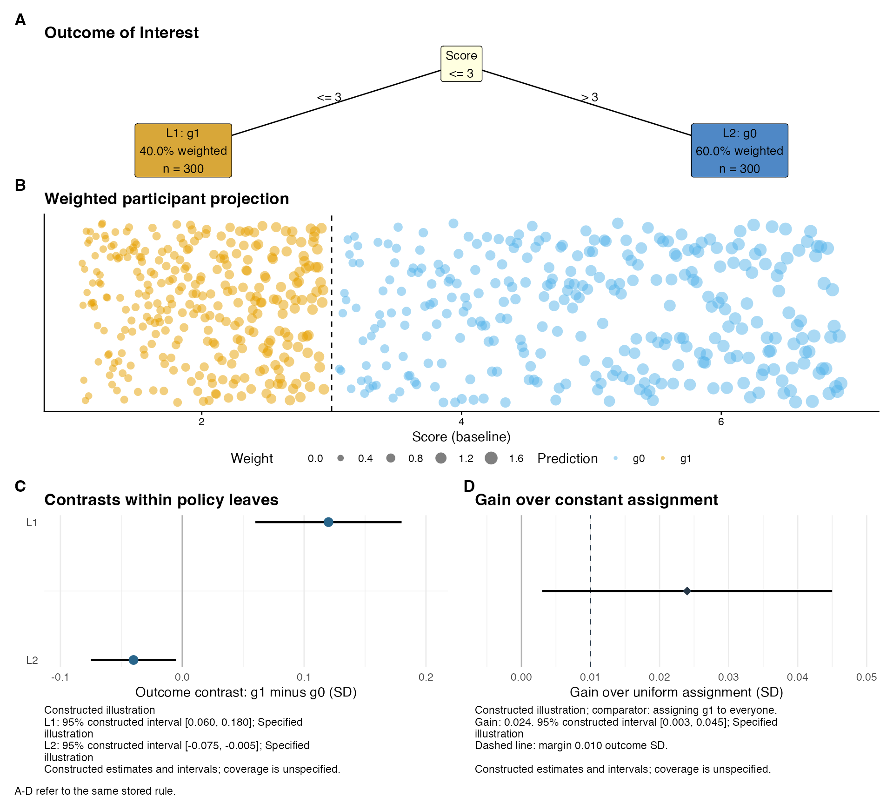

# Policy rules, weighted projections and stored evaluation

A policy-tree report should let readers follow the assignment rule, see
the people in each leaf, and assess the reported outcome contrasts. The
value comparison then asks how much the rule gains over a specified
constant assignment. These quantities can concern different scientific
targets. Each report therefore records the rule, population, scale and
evaluation method.

[`margot_policy_reporting_data()`](https://go-bayes.github.io/margot/reference/margot_policy_reporting_data.md)
binds stored estimates to those identities. Two plots,
[`margot_plot_policy_leaf_effects()`](https://go-bayes.github.io/margot/reference/margot_plot_policy_leaf_effects.md)
and
[`margot_plot_policy_value_gain()`](https://go-bayes.github.io/margot/reference/margot_plot_policy_value_gain.md),
share their numerical tables with matching text functions.
`margot_report_policy_tree(reporting_data = ...)` combines them with the
existing
[`margot_plot_policy_combo()`](https://go-bayes.github.io/margot/reference/margot_plot_policy_combo.md).
The decision tree and projection occupy the taller A/B rows; C/D appear
side by side below. Calls with `reporting_data = NULL` retain the legacy
report calculations.

## A constructed example

The example has 600 constructed reference records, with 300 in each
leaf. Unequal weights give the leaves 40% and 60% of the total reference
weight. The rule assigns g1 at scores up to and including 3, and g0
above 3. Its four-row fitting fixture supplies the native tree
representation used for plotting. Every effect estimate and interval
below is stipulated; their precision is unrelated to the number of
displayed points.

\
[`set.seed`](https://rdrr.io/r/base/Random.html)`(``20260910``)`\
`reference`` ``<-`` `[`data.frame`](https://rdrr.io/r/base/data.frame.html)`(``score ``=`` `[`c`](https://rdrr.io/r/base/c.html)`(`[`seq`](https://rdrr.io/r/base/seq.html)`(``1.08``, ``2.94``, length.out ``=`` ``300``)``,`\
`                                 `[`seq`](https://rdrr.io/r/base/seq.html)`(``3.06``, ``6.92``, length.out ``=`` ``300``)``)``)`\
`weights`` ``<-`` `[`c`](https://rdrr.io/r/base/c.html)`(`[`seq`](https://rdrr.io/r/base/seq.html)`(``.5``, ``1.1``, length.out ``=`` ``300``)``, `[`seq`](https://rdrr.io/r/base/seq.html)`(``.7``, ``1.7``, length.out ``=`` ``300``)``)`\
`tree`` ``<-`` ``policytree``::`[`policy_tree`](https://rdrr.io/pkg/policytree/man/policy_tree.html)`(`\
`  `[`data.frame`](https://rdrr.io/r/base/data.frame.html)`(``score ``=`` `[`c`](https://rdrr.io/r/base/c.html)`(``1``, ``3``, ``4``, ``7``)``)``,`\
`  `[`cbind`](https://rdrr.io/r/base/cbind.html)`(``control ``=`` ``0``, treated ``=`` `[`c`](https://rdrr.io/r/base/c.html)`(``1``, ``1``, ``-``1``, ``-``1``)``)``,`\
`  depth ``=`` ``1``, min.node.size ``=`` ``1`\
`)`\
`object`` ``<-`` `[`list`](https://rdrr.io/r/base/list.html)`(``results ``=`` `[`list`](https://rdrr.io/r/base/list.html)`(``model_example ``=`` `[`list`](https://rdrr.io/r/base/list.html)`(`\
`  policy_tree_depth_1 ``=`` ``tree``, plot_data ``=`` `[`list`](https://rdrr.io/r/base/list.html)`(``X_test ``=`` ``reference``)`\
`)``)``)`\
`leaves`` ``<-`` `[`data.frame`](https://rdrr.io/r/base/data.frame.html)`(`\
`  node_id ``=`` `[`c`](https://rdrr.io/r/base/c.html)`(``2L``, ``3L``)``, leaf_label ``=`` `[`c`](https://rdrr.io/r/base/c.html)`(``"L1"``, ``"L2"``)``,`\
`  estimate ``=`` `[`c`](https://rdrr.io/r/base/c.html)`(``.12``, ``-``.04``)``, lower ``=`` `[`c`](https://rdrr.io/r/base/c.html)`(``.06``, ``-``.075``)``, upper ``=`` `[`c`](https://rdrr.io/r/base/c.html)`(``.18``, ``-``.005``)``,`\
`  interval_type ``=`` ``"constructed"``, interval_level ``=`` ``.95``,`\
`  interval_method ``=`` ``"Specified illustration"``, unavailable_reason ``=`` ``NA_character_`\
`)`\
`value`` ``<-`` `[`data.frame`](https://rdrr.io/r/base/data.frame.html)`(`\
`  estimate ``=`` ``.024``, lower ``=`` ``.003``, upper ``=`` ``.045``,`\
`  interval_type ``=`` ``"constructed"``, interval_level ``=`` ``.95``,`\
`  interval_method ``=`` ``"Specified illustration"``, unavailable_reason ``=`` ``NA_character_``,`\
`  comparator_id ``=`` ``"constant_g1"``, comparator_label ``=`` ``"assigning g1 to everyone"``,`\
`  gain_margin ``=`` ``.01`\
`)`\
`context`` ``<-`` `[`list`](https://rdrr.io/r/base/list.html)`(`\
`  outcome ``=`` ``"example"``, outcome_label ``=`` ``"Outcome of interest"``,`\
`  rule_id ``=`` ``"example-rule"``, population_id ``=`` ``"example-target"``,`\
`  population_label ``=`` ``"Illustrative target population"``,`\
`  scale_id ``=`` ``"example-sd"``, scale_label ``=`` ``"outcome SD"``,`\
`  orientation ``=`` ``"as_scored"``, weight_id ``=`` ``"example-analysis-weights"``,`\
`  evaluation_mode ``=`` ``"constructed"``, contrast_label ``=`` ``"g1 minus g0"``,`\
`  qualification ``=`` ``"Constructed estimates and intervals; coverage is unspecified."`\
`)`\
`reporting`` ``<-`` `[`margot_policy_reporting_data`](https://go-bayes.github.io/margot/reference/margot_policy_reporting_data.md)`(`\
`  ``tree``, ``leaves``, ``value``, ``context``, reference ``=`` ``reference``,`\
`  display_weights ``=`` ``weights``, reference_label ``=`` ``"600 constructed records"``,`\
`  display_weight_id ``=`` ``"reference weights"`\
`)`\
[`stopifnot`](https://rdrr.io/r/base/stopifnot.html)`(`[`isTRUE`](https://rdrr.io/r/base/Logic.html)`(`[`all.equal`](https://rdrr.io/r/base/all.equal.html)`(``reporting``$``leaves``$``reference_share``, `[`c`](https://rdrr.io/r/base/c.html)`(``.4``, ``.6``)``)``)``)`

The constructor retains full numerical precision. It computes reference
counts and shares from every supplied row, routing threshold equality to
the tree’s inclusive branch. Display weights determine point area, with
identical circular shapes across actions. Predictor coordinates remain
exact. Vertical jitter separates points in a stump; depth-two weighted
projections preserve both predictor coordinates and display each record
in its applicable root branch. Zero-weight records contribute to
unweighted counts and have zero point area.

\
`report`` ``<-`` `[`margot_report_policy_tree`](https://go-bayes.github.io/margot/reference/margot_report_policy_tree.md)`(`\
`  ``object``, ``"example"``, depth ``=`` ``1``, reporting_data ``=`` ``reporting``,`\
`  label_mapping ``=`` `[`list`](https://rdrr.io/r/base/list.html)`(``control ``=`` ``"g0"``, treated ``=`` ``"g1"``)``,`\
`  projection_args ``=`` `[`list`](https://rdrr.io/r/base/list.html)`(``jitter_seed ``=`` ``20260910``, weight_max_size ``=`` ``5``)``,`\
`  decision_tree_args ``=`` `[`list`](https://rdrr.io/r/base/list.html)`(``text_size ``=`` ``4``)``,`\
`  reporting_heights ``=`` `[`c`](https://rdrr.io/r/base/c.html)`(``1.5``, ``1.7``, ``1``)`\
`)`\
`report``$``plots``$``combined_plot`

The reference population used for A/B can differ from the population
used to evaluate the rule in C/D. Supply the complete reference rows in
their plotting order and explicitly identify their weights. By default,
omitted display weights mean equal weights. Participant uniqueness is a
caller-verified condition, assessed using participant identifiers. Saved
rule and reference signatures detect subsequent structural or row-order
changes.

## Compact layouts and explicit labels

The compact layout makes the branching rule use the available panel
dimensions and reduces outer margins and repeated headings. A one-split
rule needs less height than a two-level rule. Use
`reporting_layout = "compact"` to choose depth-specific row proportions;
an explicit `reporting_heights` value takes precedence. C and D remain
side by side. Export height still determines the space available for
labels. Therefore, inspect the rendered figure at its intended
publication size.

\
`compact_report`` ``<-`` `[`margot_report_policy_tree`](https://go-bayes.github.io/margot/reference/margot_report_policy_tree.md)`(`\
`  ``object``, ``"example"``, depth ``=`` ``1``, reporting_data ``=`` ``reporting``,`\
`  reporting_layout ``=`` ``"compact"``,`\
`  label_mapping ``=`` `[`list`](https://rdrr.io/r/base/list.html)`(``control ``=`` ``"g0"``, treated ``=`` ``"g1"``)``,`\
`  decision_tree_args ``=`` `[`list`](https://rdrr.io/r/base/list.html)`(``branch_labels ``=`` ``"condition"``, text_size ``=`` ``3.5``)``,`\
`  projection_args ``=`` `[`list`](https://rdrr.io/r/base/list.html)`(``jitter_seed ``=`` ``20260910``, weight_max_size ``=`` ``5``)``,`\
`  panel_labels ``=`` `[`list`](https://rdrr.io/r/base/list.html)`(`\
`    C ``=`` `[`list`](https://rdrr.io/r/base/list.html)`(``x ``=`` ``"Outcome contrast: g1 minus g0 (SD)"``)``,`\
`    D ``=`` `[`list`](https://rdrr.io/r/base/list.html)`(``x ``=`` ``"Gain over uniform assignment (SD)"``)`\
`  ``)`\
`)`\
`compact_report``$``plots``$``combined_plot`

\
[`stopifnot`](https://rdrr.io/r/base/stopifnot.html)`(`[`identical`](https://rdrr.io/r/base/identical.html)`(``report``$``table``, ``compact_report``$``table``)``,`\
`          `[`identical`](https://rdrr.io/r/base/identical.html)`(``report``$``policy_value``, ``compact_report``$``policy_value``)``,`\
`          `[`identical`](https://rdrr.io/r/base/identical.html)`(``report``$``reporting_data``, ``compact_report``$``reporting_data``)``)`

Branch conditions, assigned actions and outcome contrasts have separate
meanings. A branch condition identifies which participants enter a leaf.
The leaf label names their assigned action. Panel C compares outcomes
under g1 and g0 within that leaf. Panel D compares the rule with
assigning g1 to everyone in this constructed example. For a
training-selected constant comparator, explain that its action is chosen
in the training data and may differ across folds. “Uniform assignment”
means that everyone receives the same action within an evaluation fold.

`panel_labels` accepts named lists for A, B, C and D. Each list can set
`title`, `subtitle`, `x`, `y` and `caption`; `NULL` removes a label.
This supports clean figures with a separately supplied caption. Retain
the rule identity, evaluation scope, comparator and interval
qualifications somewhere in the complete figure and caption. Label
overrides affect presentation only; they preserve the stored estimates,
weights, intervals, provenance and interpretation text.

### Plot a native rule directly

The branching plot also accepts a native
[`policytree::policy_tree()`](https://rdrr.io/pkg/policytree/man/policy_tree.html)
object directly. This is useful when a stored rule is all that needs to
be drawn. Supply additional leaf metrics as stored labels. A tree alone
records its assignment rule.

\
[`margot_plot_policy_decision_tree`](https://go-bayes.github.io/margot/reference/margot_plot_policy_decision_tree.md)`(`\
`  ``tree``, layout_style ``=`` ``"compact"``, branch_labels ``=`` ``"condition"``,`\
`  title ``=`` ``"Constructed policy rule"``, text_size ``=`` ``3.2``,`\
`  label_mapping ``=`` `[`list`](https://rdrr.io/r/base/list.html)`(``score ``=`` ``"Baseline score"``, control ``=`` ``"Assign g0"``, treated ``=`` ``"Assign g1"``)`\
`)`

`branch_labels = "condition"` prints the threshold inequality on each
branch. The inclusive left branch and exclusive right branch retain the
fitted rule’s routing. Thresholds have the same display rounding as
their parent node; routing continues to use the full stored value.
Supply `c(left = "Yes", right = "No")` for a common pair of labels, or a
table with `parent_id`, `side` and `label` for edge-specific wording. A
callback can use the edge metadata to append units:

\
[`margot_plot_policy_decision_tree`](https://go-bayes.github.io/margot/reference/margot_plot_policy_decision_tree.md)`(`\
`  ``tree``, layout_style ``=`` ``"compact"``,`\
`  branch_labels ``=`` ``function``(``edges``)`` ``{`\
`    `[`paste`](https://rdrr.io/r/base/paste.html)`(`[`ifelse`](https://rdrr.io/r/base/ifelse.html)`(``edges``$``side`` ``==`` ``"left"``, ``"<="``, ``">"``)``, ``edges``$``threshold_label``, ``"points"``)`\
`  ``}`\
`)`

Use `node_label_width` to wrap long node labels while preserving their
existing line breaks. Explicit padding and margin settings override
compact defaults. Supplied titles now retain exactly the caller’s text,
including punctuation and case. Existing calls retain the legacy
geometry and True/False branch labels unless compact layout or
alternative labels are requested.

## Standalone plots, tables and interpretations

The report object contains `decision_tree`, `projection`,
`leaf_effects`, `value_gain` and `combined_plot` under `plots`.
Standalone functions also accept the same `reporting` object. Every
interval records its type, level and supplied method. Interpretation
functions compare the unrounded gain with the resolved margin. They then
format the numbers for readers.

\
`report``$``table``[``, `[`c`](https://rdrr.io/r/base/c.html)`(``"leaf_label"``, ``"estimate"``, ``"n_reference"``, ``"reference_share"``)``]`\
`#> ``# A tibble: 2 × 4`\
`#>   leaf_label estimate n_reference reference_share`\
`#>   ``<chr>``         ``<dbl>``       ``<int>``           ``<dbl>`\
`#> ``1`` L1             0.12         300             0.4`\
`#> ``2`` L2            -``0.04``         300             0.6`\
[`cat`](https://rdrr.io/r/base/cat.html)`(`[`paste`](https://rdrr.io/r/base/paste.html)`(`[`margot_text_policy_value_gain`](https://go-bayes.github.io/margot/reference/margot_text_policy_value_gain.md)`(``reporting``)``, collapse ``=`` ``"\n\n"``)``)`\
`#> Outcome of interest: Constructed illustration; Illustrative target population.`\
`#> `\
`#> Relative to assigning g1 to everyone, the stored gain is 0.024 outcome SD. The estimate exceeds the practical margin of 0.010 outcome SD.`\
`#> `\
`#> 95% constructed interval [0.003, 0.045]; Specified illustration.`\
`#> `\
`#> The interval includes gains below the practical margin.`\
`#> `\
`#> Constructed estimates and intervals; coverage is unspecified.`

Here the gain of 0.024 SD exceeds the practical margin of 0.01 SD.
However, the constructed interval, from 0.003 to 0.045 SD, includes
gains below that margin. The estimate, interval and margin answer
different questions. The analysis supplies its resolved margin to the
report. The existing policy-learning defaults of 0.01 for depth
improvement and tree-versus-constant gain remain configurable.
Intervention costs require their own specification.

For reversed outcomes, supply estimates and endpoints on the already
reversed scale, set `orientation = "reversed"`, and include the reversal
in `outcome_label`. The reporting layer preserves the supplied numbers
and labels their orientation. Leaf comparisons describe the named action
contrast within each group. A difference between leaf effects requires a
direct contrast and its uncertainty. The effect of intervening on a
splitting variable requires a separate causal question and
identification argument.

## Retaining legacy results and unavailable uncertainty

Stored leaf summaries can be adapted by mapping their node identifiers,
contrasts and endpoints into the explicit table schema. For example, a
saved
[`margot_policy_leaf_summary()`](https://go-bayes.github.io/margot/reference/margot_policy_leaf_summary.md)
table has `node_id`, `treatment_control_contrast`,
`treatment_control_ci_low` and `treatment_control_ci_high`. Preserve its
recorded confidence level and method. When its leaves were selected in
the same full sample, use `evaluation_mode = "selected_full_sample"` and
`interval_type = "nominal_fixed_leaves"`; those intervals treat the
selected groups as fixed and ignore selection.

For a saved cross-validation result, the selected row of
`policy_selection` supplies `tree_minus_honest_constant` and
`min_gain_over_constant`. Match the model and selected depth, retain the
training-selected constant comparator, and check the recorded value
difference before adapting it. A fold-specific comparator can change
across folds; describe it as the training-selected constant procedure
with its fold-specific action choices. Supply a `value_context` with
`evaluation_mode = "repeated_learning"` and its procedure identity. The
report distinguishes A–C’s selected full-sample rule from D’s learning
procedure.

Repeated-fold or repeated-split quantiles describe partition
variability. A sampling interval requires a variance estimator that
accounts for participant reuse across folds and repeats. When compatible
uncertainty is unavailable, retain the estimate and provide its reason:

\
`value_unavailable`` ``<-`` ``value`\
`value_unavailable``$``lower`` ``<-`` ``value_unavailable``$``upper`` ``<-`` ``NA_real_`\
`value_unavailable``$``interval_type`` ``<-`` ``"unavailable"`\
`value_unavailable``$``unavailable_reason`` ``<-`` ``"Saved outputs omit compatible sampling uncertainty"`\
`without_interval`` ``<-`` `[`margot_policy_reporting_data`](https://go-bayes.github.io/margot/reference/margot_policy_reporting_data.md)`(``tree``, ``leaves``, ``value_unavailable``, ``context``)`\
[`cat`](https://rdrr.io/r/base/cat.html)`(`[`paste`](https://rdrr.io/r/base/paste.html)`(`[`margot_text_policy_value_gain`](https://go-bayes.github.io/margot/reference/margot_text_policy_value_gain.md)`(``without_interval``)``, collapse ``=`` ``"\n\n"``)``)`\
`#> Outcome of interest: Constructed illustration; Illustrative target population.`\
`#> `\
`#> Relative to assigning g1 to everyone, the stored gain is 0.024 outcome SD. The estimate exceeds the practical margin of 0.010 outcome SD.`\
`#> `\
`#> Interval unavailable: Saved outputs omit compatible sampling uncertainty.`\
`#> `\
`#> Constructed estimates and intervals; coverage is unspecified.`

## Independently evaluated rules

Learning a rule and choosing its comparator on development participants
can leave independent participants for evaluation. Conditional on
development, inference can then concern the population value difference
for that realised rule. Repeated tree learning addresses the separate
question of how the learning procedure varies across development
samples.

The reporting interface can describe externally supplied independent
evaluation results using `independent_fixed_rule`, distinct
development/evaluation identities and an explicit interval method. Those
labels record caller-supplied provenance. Valid inference still requires
a justified evaluation score, nuisance estimation, weighting,
outcome-scale reference, overlap, sampling unit and sufficiently small
remaining bias. The independent interval estimator and its coverage
validation remain outside this reporting implementation. A 70/30
partition remains a candidate design.
