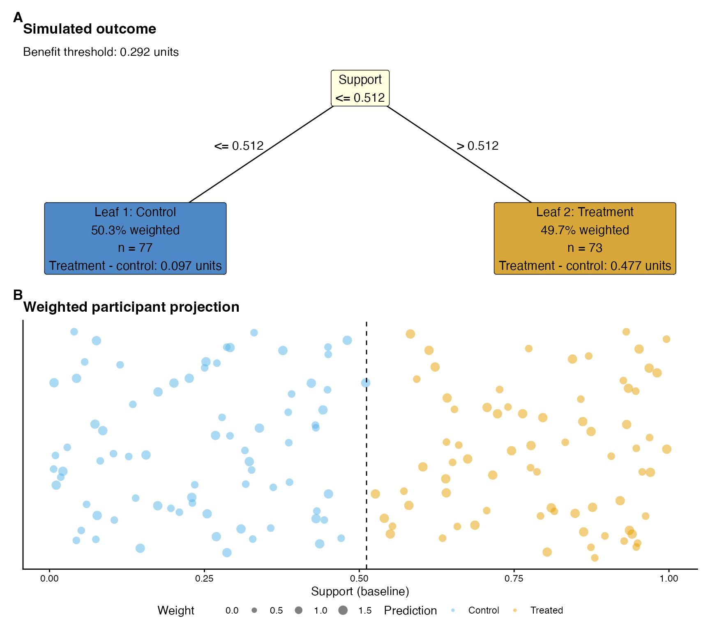
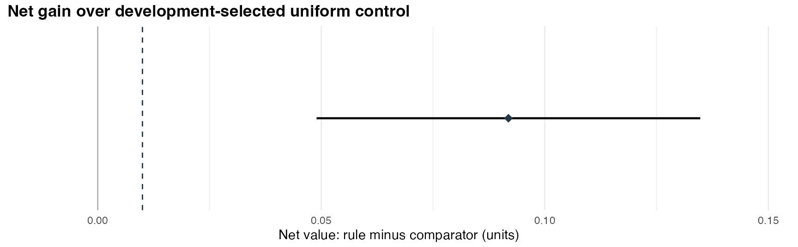

# Interpretable policy trees with benefit thresholds

Treatment can benefit everyone while benefiting some groups more than
others. A policy tree optimising the outcome alone can then assign
treatment throughout the population. A benefit threshold makes the
magnitude of the expected benefit relevant to allocation. This article
develops a shallow rule under an explicit threshold, evaluates the
unchanged rule on independent participants, and reports its original
effects alongside its net value.

## Set the benefit threshold before evaluation

Let the benefit threshold be $`\phi`$, expressed in outcome units where
larger values are preferred. Under additive costs and linear outcome
valuation, an incremental treatment cost $`c`$ and a value $`v>0`$ per
outcome unit give $`\phi=c/v`$. Net value subtracts $`\phi`$ for each
person assigned treatment. The comparison between a policy tree and a
constant assignment must apply the same threshold to both rules.

An **ATE-referenced benefit threshold** uses the development-sample
estimate of the average treatment effect (ATE) as a hypothetical cost
equivalent. This reference asks which interpretable groups warrant
treatment relative to the development average. Its interpretation is a
relative-effect allocation question; economic valuation would require
justified costs and outcome values. A zero or negative estimated ATE
remains a signed reference; describing it as a positive treatment
expense would change its meaning.

The threshold and the gain margin have different roles. The threshold
adjusts benefit per treatment recipient. The gain margin specifies a
population-average improvement over a comparator. Here we use the
development ATE as the threshold and an illustrative gain margin of 0.01
outcome units. The margin accompanies the evaluation result.

## Simulate development and evaluation participants

Our example simulates 500 independent participants with baseline support
and age, randomised binary treatment, and a continuous outcome. The true
treatment effect is 0.10 outcome units at lower support and 0.50 at
higher support. Artificial analysis weights give older participants
greater weight in the target average. Outcome units remain unchanged
throughout scoring, threshold estimation and evaluation.

\
[`set.seed`](https://rdrr.io/r/base/Random.html)`(``20260911``)`\
`n`` ``<-`` ``500L`\
`features`` ``<-`` `[`cbind`](https://rdrr.io/r/base/cbind.html)`(``support ``=`` `[`runif`](https://rdrr.io/r/stats/Uniform.html)`(``n``)``, age ``=`` `[`runif`](https://rdrr.io/r/stats/Uniform.html)`(``n``, ``18``, ``80``)``)`\
`treatment`` ``<-`` `[`rbinom`](https://rdrr.io/r/stats/Binomial.html)`(``n``, ``1``, ``.5``)`\
`true_effect`` ``<-`` `[`ifelse`](https://rdrr.io/r/base/ifelse.html)`(``features``[``, ``"support"``]`` ``<=`` ``.5``, ``.10``, ``.50``)`\
`outcome`` ``<-`` ``.1`` ``*`` ``features``[``, ``"support"``]`` ``+`` ``.005`` ``*`` ``features``[``, ``"age"``]`` ``+`\
`  ``treatment`` ``*`` ``true_effect`` ``+`` `[`rnorm`](https://rdrr.io/r/stats/Normal.html)`(``n``, sd ``=`` ``.15``)`\
`weights`` ``<-`` `[`ifelse`](https://rdrr.io/r/base/ifelse.html)`(``features``[``, ``"age"``]`` ``>`` ``50``, ``1.5``, ``1``)`\
`development`` ``<-`` `[`sample`](https://rdrr.io/r/base/sample.html)`(`[`seq_len`](https://rdrr.io/r/base/seq.html)`(``n``)``, ``350L``)`\
`evaluation`` ``<-`` `[`setdiff`](https://generics.r-lib.org/reference/setops.html)`(`[`seq_len`](https://rdrr.io/r/base/seq.html)`(``n``)``, ``development``)`

The random partition precedes every fitted model. In an empirical study,
the development boundary must also govern imputation, outcome scaling,
candidate-variable selection and estimated weights where applicable.
This simulation has complete baseline features, a prespecified outcome
scale and weights directly determined from age.

## Fit nuisance models using development participants

[`margot_policy_development_scores()`](https://go-bayes.github.io/margot/reference/margot_policy_development_scores.md)
fits the outcome, exposure and causal forests using development
participants. Out-of-bag predictions supply development action scores.
For evaluation participants, the helper uses predictions from those
development-trained models and then incorporates the evaluation outcomes
into residual corrections. The returned action scores retain their
original outcome units. Weighting and threshold subtraction occur in the
next step.

\
`scores`` ``<-`` `[`margot_policy_development_scores`](https://go-bayes.github.io/margot/reference/margot_policy_development_scores.md)`(`\
`  development_X ``=`` ``features``[``development``, , drop ``=`` ``FALSE``]``,`\
`  development_Y ``=`` ``outcome``[``development``]``,`\
`  development_W ``=`` ``treatment``[``development``]``,`\
`  evaluation_X ``=`` ``features``[``evaluation``, , drop ``=`` ``FALSE``]``,`\
`  evaluation_Y ``=`` ``outcome``[``evaluation``]``,`\
`  evaluation_W ``=`` ``treatment``[``evaluation``]``,`\
`  development_weights ``=`` ``weights``[``development``]``,`\
`  forest_args ``=`` `[`list`](https://rdrr.io/r/base/list.html)`(``num.trees ``=`` ``200L``, min.node.size ``=`` ``5L``)``,`\
`  seed ``=`` ``20260912L``,`\
`  num_threads ``=`` ``1L`\
`)`

This small forest count keeps the example quick to execute. Applied
analyses need an appropriate, prespecified forest configuration. The
helper establishes the model-fitting boundary; causal identification,
nuisance-estimation accuracy and the sampling design remain substantive
requirements. When suitable nuisance predictions already exist,
[`margot_policy_action_scores()`](https://go-bayes.github.io/margot/reference/margot_policy_action_scores.md)
constructs the same binary action-score representation from those
predictions.

## Learn the rule and apply its threshold in evaluation

[`margot_policy_tree_evaluate()`](https://go-bayes.github.io/margot/reference/margot_policy_tree_evaluate.md)
resolves the ATE threshold using weighted development action-score
contrasts. It subtracts that threshold from the treatment score and
applies analysis weights once. The example uses depth-one trees
throughout. With the ATE reference, universal treatment and universal
control tie in development net value up to numerical tolerance; the
comparator deterministically chooses control. The evaluator retains a
constant rule when its development value equals or exceeds the tree
value within numerical tolerance.

\
`fit`` ``<-`` `[`margot_policy_tree_evaluate`](https://go-bayes.github.io/margot/reference/margot_policy_tree_evaluate.md)`(`\
`  development_X ``=`` ``features``[``development``, , drop ``=`` ``FALSE``]``,`\
`  development_scores ``=`` ``scores``$``development_scores``,`\
`  evaluation_X ``=`` ``features``[``evaluation``, , drop ``=`` ``FALSE``]``,`\
`  evaluation_scores ``=`` ``scores``$``evaluation_scores``,`\
`  development_weights ``=`` ``weights``[``development``]``,`\
`  evaluation_weights ``=`` ``weights``[``evaluation``]``,`\
`  value_threshold ``=`` ``"ate"``,`\
`  depth ``=`` ``1L``,`\
`  min_node_size ``=`` ``30L``,`\
`  tree_method ``=`` ``"policytree"``,`\
`  development_ids ``=`` ``development``,`\
`  evaluation_ids ``=`` ``evaluation``,`\
`  gain_margin ``=`` ``.01`\
`)`\
`fit``$``threshold``$``value`\
`#> [1] 0.2924217`

The realised threshold, tree, constant comparator and participant
identities are stored together. Evaluation applies the unchanged
development rule and threshold. A full-data refit would define another
rule and threshold, requiring its own reporting identity.

The evaluation object reports original outcome value (`gross`), the
threshold adjustment (`cost`) and their difference (`net`). Here `cost`
denotes the hypothetical threshold adjustment. The following comparisons
all use net value. They remain prespecified comparisons, with the
primary comparator selected during development.

\
`knitr``::`[`kable`](https://rdrr.io/pkg/knitr/man/kable.html)`(``fit``$``evaluation``$``values``, digits ``=`` ``3``)`

| policy               | gross_value |  cost | net_value |
|:---------------------|------------:|------:|----------:|
| tree                 |       0.550 | 0.145 |     0.405 |
| development_constant |       0.313 | 0.000 |     0.313 |
| universal_control    |       0.313 | 0.000 |     0.313 |
| universal_treated    |       0.599 | 0.292 |     0.307 |

\
`knitr``::`[`kable`](https://rdrr.io/pkg/knitr/man/kable.html)`(`\
`  ``fit``$``evaluation``$``comparisons``[``, `[`c`](https://rdrr.io/r/base/c.html)`(``"comparator_label"``, ``"estimate"``, ``"lower"``, ``"upper"``)``]``,`\
`  digits ``=`` ``3``,`\
`  col.names ``=`` `[`c`](https://rdrr.io/r/base/c.html)`(``"Comparator"``, ``"Net gain"``, ``"Lower"``, ``"Upper"``)`\
`)`

| Comparator                           | Net gain | Lower | Upper |
|:-------------------------------------|---------:|------:|------:|
| Development-selected uniform control |    0.092 | 0.049 | 0.135 |
| Universal control                    |    0.092 | 0.049 | 0.135 |
| Universal treatment                  |    0.098 | 0.056 | 0.141 |

The intervals are nominal pointwise 95% paired weighted-score intervals
for independent evaluation records. They condition on the learned rule,
realised threshold, supplied nuisance scores and preparation. Their
scope excludes uncertainty across development samples,
nuisance-estimation bias, estimated weights, clustering and
multiplicity. Suitable nuisance conditions and a compatible sampling
design are needed for a causal interpretation.

## Report the evaluated rule with its original effects

[`margot_policy_evaluation_reporting_data()`](https://go-bayes.github.io/margot/reference/margot_policy_evaluation_reporting_data.md)
binds the evaluated rule to explicit outcome, population, scale and
display identities. The adapter validates the saved object before
reporting. Original treatment-minus-control leaf effects stay distinct
from threshold-adjusted net comparisons: below-average benefit can still
be positive benefit.

\
`context`` ``<-`` `[`list`](https://rdrr.io/r/base/list.html)`(`\
`  outcome ``=`` ``"example"``,`\
`  outcome_label ``=`` ``"Simulated outcome"``,`\
`  population_id ``=`` ``"age-weighted-simulation"``,`\
`  population_label ``=`` ``"Simulated population weighted towards older participants"``,`\
`  scale_id ``=`` ``"original-units"``,`\
`  scale_label ``=`` ``"units"``,`\
`  orientation ``=`` ``"as_scored"``,`\
`  weight_id ``=`` ``"fixed-age-weights"``,`\
`  contrast_label ``=`` ``"Treatment - control"``,`\
`  qualification ``=`` ``"Simulated randomised treatment; fixed age-based weights."`\
`)`\
`reporting`` ``<-`` `[`margot_policy_evaluation_reporting_data`](https://go-bayes.github.io/margot/reference/margot_policy_evaluation_reporting_data.md)`(`\
`  ``fit``, ``context``,`\
`  reference ``=`` `[`as.data.frame`](https://rdrr.io/r/base/as.data.frame.html)`(``features``[``evaluation``, , drop ``=`` ``FALSE``]``)``,`\
`  display_weights ``=`` ``weights``[``evaluation``]``,`\
`  reference_label ``=`` ``"Evaluation participants"``,`\
`  display_weight_id ``=`` ``"Age-based analysis weights"`\
`)`\
`plot_object`` ``<-`` `[`list`](https://rdrr.io/r/base/list.html)`(``results ``=`` `[`list`](https://rdrr.io/r/base/list.html)`(``model_example ``=`` `[`list`](https://rdrr.io/r/base/list.html)`(`\
`  policy_tree_depth_1 ``=`` ``fit``$``tree``,`\
`  plot_data ``=`` `[`list`](https://rdrr.io/r/base/list.html)`(``X_test ``=`` `[`as.data.frame`](https://rdrr.io/r/base/as.data.frame.html)`(``features``[``evaluation``, , drop ``=`` ``FALSE``]``)``)`\
`)``)``)`\
`report`` ``<-`` `[`margot_report_policy_tree`](https://go-bayes.github.io/margot/reference/margot_report_policy_tree.md)`(`\
`  ``plot_object``, ``"example"``, depth ``=`` ``1``,`\
`  reporting_data ``=`` ``reporting``,`\
`  reporting_layout ``=`` ``"two_panel"``,`\
`  label_mapping ``=`` `[`list`](https://rdrr.io/r/base/list.html)`(``support ``=`` ``"Support"``, age ``=`` ``"Age"``)``,`\
`  projection_args ``=`` `[`list`](https://rdrr.io/r/base/list.html)`(``jitter_seed ``=`` ``20260913L``)`\
`)`

\
`report``$``plots``$``combined_plot`

Panel A shows the development rule, its threshold, and original
leaf-effect estimates from evaluation participants. Leaf percentages use
the displayed analysis weights. Panel B places those participants on the
original predictor scale; circle area represents weight, colour
identifies assignment, and vertical jitter separates overlapping
records. This explanation remains editable caption text alongside the
artwork. The selected split describes an assignment rule. Causal
mechanisms and individual treatment responses require other evidence.

The two-panel layout retains the numerical evaluation tables and the
separate uncertainty plots. The leaf table below reports original
treatment-control effects and their conditional intervals. A claim that
the leaf effects differ needs a direct between-leaf contrast and its
uncertainty.

\
`knitr``::`[`kable`](https://rdrr.io/pkg/knitr/man/kable.html)`(`\
`  ``report``$``table``[``, `[`c`](https://rdrr.io/r/base/c.html)`(``"leaf_label"``, ``"selected_action"``, ``"reference_share"``, ``"estimate"``, ``"lower"``, ``"upper"``)``]``,`\
`  digits ``=`` ``3``,`\
`  col.names ``=`` `[`c`](https://rdrr.io/r/base/c.html)`(``"Leaf"``, ``"Assignment"``, ``"Weighted share"``, ``"Original effect"``, ``"Lower"``, ``"Upper"``)`\
`)`

| Leaf   | Assignment | Weighted share | Original effect | Lower | Upper |
|:-------|:-----------|---------------:|----------------:|------:|------:|
| Leaf 1 | control    |          0.503 |           0.097 | 0.018 | 0.176 |
| Leaf 2 | treated    |          0.497 |           0.477 | 0.396 | 0.559 |

The standalone evaluation plot shows the net gain and its conditional
95% interval. Its dashed line marks the illustrative 0.01-unit
population-average gain margin.

\
`report``$``plots``$``value_gain`` ``+`` ``ggplot2``::`[`labs`](https://ggplot2.tidyverse.org/reference/labs.html)`(`\
`  caption ``=`` ``NULL``,`\
`  title ``=`` ``"Net gain over development-selected uniform control"`\
`)`

`report$text$leaves` and `report$text$value` describe the same saved
estimates and qualifications. `report$plots$leaf_effects` provides the
corresponding leaf-effect interval plot. These components allow an
article to retain uncertainty beside clean tree artwork.

## Interpret an apparent split

An estimated ATE threshold introduces an additional source of
uncertainty. Suppose the true treatment effect is constant everywhere.
Centring on that true effect makes every assignment rule equally
valuable. However, an estimated development ATE generally differs from
the true effect. Conditional on that estimated threshold, universal
treatment or universal control may have higher net value throughout the
population. A selected tree can then outperform the development-selected
comparator on evaluation data even though true effects are homogeneous.

Consequently, positive gain over the development-selected constant alone
can occur under homogeneous effects. Report the prespecified
universal-action comparisons, the original leaf effects and their
uncertainty, and the stability of the learned rule. Validate the
procedure under both constant-zero and constant-nonzero effects as well
as heterogeneous effects. The threshold makes the allocation question
explicit; the evidence must establish whether the proposed groups show
reproducible differences.

Existing
[`margot_policy_tree_cv()`](https://go-bayes.github.io/margot/reference/margot_policy_tree_cv.md)
calls retain their zero-threshold default. Opting into an ATE threshold
changes their value objective while preserving original leaf contrasts.
Stored-score cross-validation and this development-only fixed-rule
evaluation have different information boundaries and uncertainty
targets; choose the evaluation design before interpreting either result.
